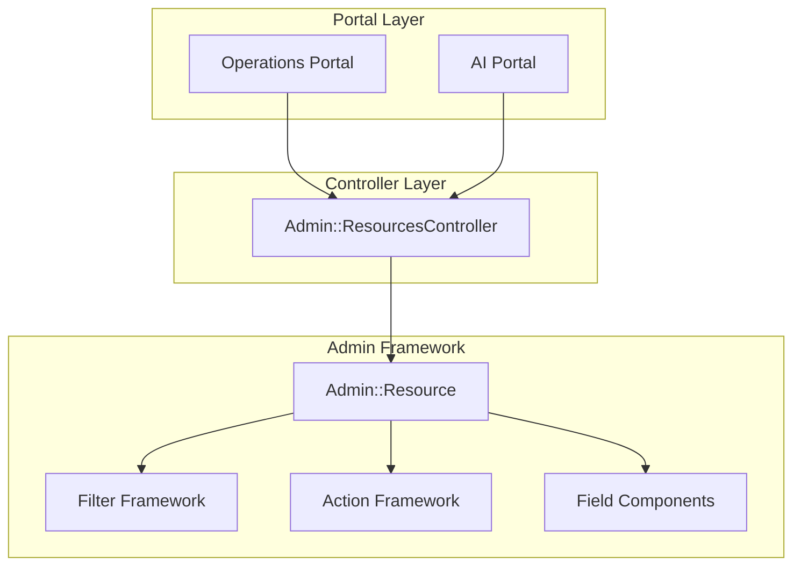

# Admin Panel Framework Redesign

## Overview

Build a unified admin framework replacing both custom admin and Avo, featuring:

- Two portals: Operations and AI
- Declarative resource definitions
- Rich form field components
- Complete Avo removal

---

## Part 1: Framework Architecture




### Resource Definition DSL Example

```ruby
class Admin::Resources::CompanyResource < Admin::Resource
  model Company
  portal :ops
  section :content
  
  index do
    searchable :name, :website
    sortable :name, :created_at
    
    columns do
      column :company, render: :company_cell
      column :job_listings, -> (c) { c.job_listings.count }
    end
    
    filters do
      filter :search, type: :text
      filter :has_website, type: :toggle  # NEW: Toggle filter
    end
  end
  
  form do
    field :name, required: true
    field :website, type: :url
    field :is_active, type: :toggle           # Toggle switch
    field :industry_id, type: :searchable_select, 
          collection: -> { Industry.all },
          create_url: :admin_industries_path   # Creatable select
    field :about, type: :markdown              # Markdown editor
    field :description, type: :rich_text       # Trix editor
    field :logo, type: :file, accept: "image/*"
  end
  
  actions do
    action :disable, confirm: "Disable?"
    bulk_action :bulk_disable
  end
end
```

---

## Part 2: Form Field Components

### Directory Structure

```javascript
app/
├── views/admin/fields/
│   ├── _toggle.html.erb          # Boolean toggle switch
│   ├── _searchable_select.html.erb
│   ├── _markdown.html.erb        # EasyMDE wrapper
│   ├── _rich_text.html.erb       # Trix/ActionText
│   ├── _file.html.erb            # File upload with preview
│   ├── _json.html.erb            # JSON editor (exists)
│   ├── _tag_picker.html.erb      # Multi-select tags
│   ├── _date_range.html.erb      # Date picker
│   └── _color.html.erb           # Color picker
├── javascript/controllers/
│   ├── toggle_controller.js      # NEW
│   ├── searchable_select_controller.js  # NEW (extends autocomplete)
│   ├── markdown_editor_controller.js    # EXISTS
│   ├── file_upload_controller.js        # EXISTS
│   └── tag_picker_controller.js         # EXISTS
```


### Component Specifications

#### 1. Toggle Switch (`_toggle.html.erb`)

```erb
<%# Usage: render "admin/fields/toggle", form: f, field: :is_active, label: "Active" %>
<div data-controller="toggle" class="flex items-center gap-3">
  <button type="button"
    data-toggle-target="button"
    data-action="toggle#toggle"
    role="switch"
    aria-checked="<%= form.object.send(field) %>"
    class="relative inline-flex h-6 w-11 items-center rounded-full transition-colors
           <%= form.object.send(field) ? 'bg-amber-500' : 'bg-slate-300 dark:bg-slate-600' %>">
    <span class="inline-block h-4 w-4 transform rounded-full bg-white transition-transform
                 <%= form.object.send(field) ? 'translate-x-6' : 'translate-x-1' %>"></span>
  </button>
  <%= form.hidden_field field, data: { toggle_target: "input" } %>
  <span class="text-sm text-slate-700 dark:text-slate-300"><%= label %></span>
</div>
```


#### 2. Searchable + Creatable Select (`_searchable_select.html.erb`)

Extends existing `autocomplete_controller.js`:

- Dropdown with search filtering
- Keyboard navigation (arrow keys, enter)
- "Create new" option at bottom
- Modal for inline creation
- Multiple selection support (optional)
```erb
<%# Usage: render "admin/fields/searchable_select", 
      form: f, field: :company_id, 
      collection: Company.active,
      search_url: autocomplete_companies_path,
      create_url: companies_path,
      creatable: true %>
```


#### 3. Markdown Editor (`_markdown.html.erb`)

Wraps existing `markdown_editor_controller.js` (EasyMDE):

```erb
<%# Usage: render "admin/fields/markdown", form: f, field: :content, rows: 20 %>
<div data-controller="markdown-editor">
  <%= form.label field, class: "form-label" %>
  <%= form.text_area field, 
      data: { markdown_editor_target: "textarea" },
      rows: rows || 12,
      class: "form-input" %>
</div>
```


#### 4. Rich Text / Trix (`_rich_text.html.erb`)

Uses Rails ActionText:

```erb
<%# Usage: render "admin/fields/rich_text", form: f, field: :body %>
<div class="rich-text-field">
  <%= form.label field, class: "form-label" %>
  <%= form.rich_text_area field, class: "trix-content" %>
</div>
```


#### 5. File Upload (`_file.html.erb`)

Enhanced existing `file_upload_controller.js`:

- Drag and drop zone
- Image preview for image types
- File type/size validation
- Progress indicator
- Multiple file support (optional)
```erb
<%# Usage: render "admin/fields/file", 
      form: f, field: :logo, 
      accept: "image/*", 
      preview: true,
      max_size: 5.megabytes %>
```


### Stimulus Controllers to Create/Update

| Controller | Status | Purpose ||------------|--------|---------|| `toggle_controller.js` | NEW | Toggle switch state management || `searchable_select_controller.js` | NEW | Search/create select dropdown || `file_upload_controller.js` | UPDATE | Add preview, validation, progress || `markdown_editor_controller.js` | EXISTS | No changes needed || `tag_picker_controller.js` | EXISTS | Minor enhancements |---

## Part 3: Portal Organization

**Operations Portal** (`/admin/ops`)

- Users & Email, Content, Scraping, Support, Settings

**AI Portal** (`/admin/ai`)

- Assistant resources, LLM resources

---

## Part 4: Avo Removal

### Files to Delete (42 files)

**Resources** (15): `app/avo/resources/*.rb`**Actions** (8): `app/avo/actions/*.rb`**Filters** (4): `app/avo/filters/*.rb`**Controllers** (13): `app/controllers/avo/*.rb`**Config** (1): `config/initializers/avo.rb`

### Directories to Remove

- `app/avo/`
- `app/controllers/avo/`

### Updates Required

- Remove from `Gemfile`: `gem "avo", ">= 3"`
- Remove from `routes.rb`: `mount_avo`, `mount Avo::Engine`

---

## Part 5: Migration Strategy

### Phase 1: Framework Foundation

- Create `app/admin/base/` classes
- Create field component partials and controllers

### Phase 2: Form Field Components

- Implement toggle, searchable_select, file upload components
- Integrate Trix/ActionText
- Enhance markdown editor wrapper

### Phase 3: Portal Structure

- Create portal navigation
- Update routes with namespaces
- Create portal dashboards

### Phase 4: Migrate Resources

- Start with simple: Company, JobRole, SkillTag
- Then complex: AssistantToolExecutions, LlmPrompts
- Finally Avo-only: CompanyFeedback, InterviewRound

### Phase 5: Avo Removal

- Delete all Avo files
- Remove gem and routes
- Verify and cleanup

---

## Benefits Summary