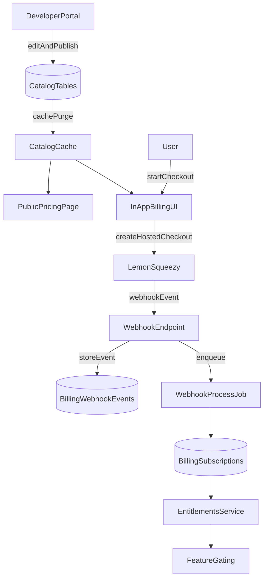

# Billing, Subscriptions, and Scalable Settings Navigation

## Settings UX recommendation (based on current implementation)

The current Settings nav is a horizontal tab bar implemented with `flex flex-wrap`, so as tabs increase it will wrap into multiple rows (hard to scan, pushes content down, inconsistent active state visibility). See [`app/views/settings/show.html.erb`](/workspaces/gleania/app/views/settings/show.html.erb).

Recommended direction:

- Move to a **vertical Settings sidebar** on desktop (left column), grouped into 3–5 sections.
- On mobile, render the same nav as a **select/dropdown** (or a compact segmented control for the top 3–4 items), avoiding horizontal scrolling.
- Keep top-level Settings items stable; put “tab explosion” into **subsections inside panels** (e.g., Billing → Plan, Payment method, Invoices, Usage).

Implementation target: keep `/settings` as the entry point, but render a 2-column layout with sidebar + content area.

## Domain model: plans, features, entitlements (customizable + future-proof)

### Core catalog tables (developer-portal managed)

Create a first-class billing/catalog namespace (e.g., `Billing::*`) with:

- **`Billing::Plan`**: key, name, description, type (`free`, `recurring`, `one_time`), interval/period, price/currency (or via prices table), highlight flags, published state.
- **`Billing::Feature`**: key (stable identifier), name, description, kind (`boolean`, `quota`), unit (e.g. `ai_tokens`, `interviews`, `exports`).
- **`Billing::PlanEntitlement`** (join): per-plan enabled/limit values per feature.
- **`Billing::ProviderMapping`**: links internal plans/prices to external LemonSqueezy product/variant IDs.

### Per-user billing state

- **`Billing::Customer`**: per-provider customer identity for a user.
- **`Billing::Subscription`**: provider, external ID, plan, status, renewals, period boundaries, cancel flags.
- **`Billing::EntitlementGrant`**: explicit grants/overrides (used for Sprint 30-day pass, support overrides, promos).
- **Usage tracking** (for quotas like AI): start with counters stored per period (e.g., `Billing::UsageCounter`), incremented at the point of consumption.

### Feature gating API

Add a single entitlement API used everywhere:

- `Billing::Entitlements.for(user).allowed?(:feature_key)`
- `Billing::Entitlements.for(user).limit(:feature_key)` and `remaining(...)`

This keeps gating consistent for app UI, controllers, and service objects.

## Insight-triggered 72-hour Pro trial (earned, non-salesy)

We will implement your “unlock Pro for 72 hours after first real insight” as an **internal, time-boxed entitlement grant**, not a provider-level trial. This ensures it works regardless of payment provider and can be edited safely from the developer portal.

Key behaviors:

- **Once per user lifetime** (guard against gaming).
- **Starts at the first qualifying trigger** (not on signup).
- **Only unlocks selected Pro features** (no export, no Sprint depth, no high AI usage).

### Trigger conditions (any one)

- CV uploaded + first feedback entry added, or
- 2 interviews completed, or
- first AI synthesis requested.

### Storage and evaluation

- Add/extend `Billing::EntitlementGrant` to support `source: :trial`, `reason: :insight_triggered`, `starts_at`, `expires_at`, and optional metadata (which trigger fired).
- Add a `Billing::TrialUnlockService` that is called from the relevant creation points (CV upload, feedback create, interview completion, AI synthesis request). It will:\n  - check eligibility (no previous trial grant, no active paid subscription)\n  - create a 72-hour grant (idempotent)\n  - emit logs + Sentry context on failures

### UX

- On grant creation: show a banner/toast: “You’ve unlocked Pro insights for 72 hours.”\n- In Billing UI: show trial end time and “Upgrade to keep these insights.”\n- On expiry: downgrade seamlessly to Free entitlements (no data loss).

### Cost control (AI quotas)

- Model AI access as multiple features/tiers:\n  - `ai_summaries_basic`\n  - `ai_synthesis_advanced`\n  - `assistant_access`\n  - `ai_quota_level` (low/normal/high)\n- Trial grants set `ai_quota_level` to **normal** but keep an absolute cap via usage counters.

## LemonSqueezy integration (default provider) + provider abstraction

### Provider abstraction

Define a provider interface (service objects) that supports:

- Creating a checkout (hosted)
- Mapping external events to internal subscription state
- Returning a customer portal URL (if/when used)
- Syncing catalog mappings (internal → provider)

Implement first provider: `Billing::Providers::LemonSqueezy`.

### Checkout + in-app billing UI (per your choice)

- Use **LemonSqueezy hosted checkout** for payment capture.
- Build **in-app Billing UI** for:
- Current plan
- Upgrade/downgrade (creates a new checkout link)
- Cancel/resume (via provider API if supported)
- Invoice history (sync or deep-link)

### Webhooks (critical)

- Add a dedicated webhook controller endpoint (e.g. `POST /webhooks/lemon_squeezy`).
- Verify webhook signature using credentials.
- Store every event in `Billing::WebhookEvent` (idempotency key, payload, received_at, processed_at, status).
- Process asynchronously via ActiveJob; update `Billing::Subscription` + entitlement cache.

## Developer portal: Payments portal (catalog + mappings + auditing)

Leverage the existing internal developer portal resource framework (`app/admin/resources/*` and `Internal::Developer::BaseController`).

### Add a new portal

- Add `:payments` to the navigation structure and routes under `config/routes/developer.rb`.

### Resources to expose

Create `Admin::Resources::*Resource` entries for:

- Plans
- Features
- Plan entitlements
- Provider mappings
- Subscriptions (read-only initially)
- Webhook events (read-only + replay action)

### “Immediate reflection”

Mirror the pattern used by `Setting` (`after_commit` cache purge + short TTL) so:

- Dev portal edits → **cache invalidation** → app/public pricing updates immediately.

## Public pricing pages + in-app plan surfaces

- Implement a public pricing page that reads **published** plans and renders the Free/Pro/Sprint framing.
- Implement an in-app “Upgrade” entry point that uses the same catalog.

## Observability, safety, and operational tooling

- Use existing `ExceptionNotifier` + Sentry for all billing failures with `context: "payment"` and tags like provider/event_type/subscription_id.
- Add structured logs around checkout creation and webhook processing.
- Add replay tooling for failed webhook events (dev portal action).
- Ensure webhook processing is idempotent and safe under retries.

## Rollout plan (phased)

### Phase 1: Catalog + gating

- Add catalog models, entitlements service, and a minimal “current plan” view.

### Phase 2: LemonSqueezy checkout + webhooks

- Implement hosted checkout creation and webhook-driven subscription sync.

### Phase 3: Developer portal Payments portal

- CRUD for plans/features/entitlements + provider mappings + audit logs.

### Phase 4: Public pricing + polish

- Public pricing page, upgrade flows, cancellations, and usage UI.

## Data flow diagram

## Primary files/directories that will be touched

- Settings UI: [`app/views/settings/show.html.erb`](/workspaces/gleania/app/views/settings/show.html.erb), [`app/controllers/settings_controller.rb`](/workspaces/gleania/app/controllers/settings_controller.rb)
- Developer portal framework: [`config/routes/developer.rb`](/workspaces/gleania/config/routes/developer.rb), [`app/controllers/internal/developer/base_controller.rb`](/workspaces/gleania/app/controllers/internal/developer/base_controller.rb), [`app/admin/resources/*`](/workspaces/gleania/app/admin/resources)