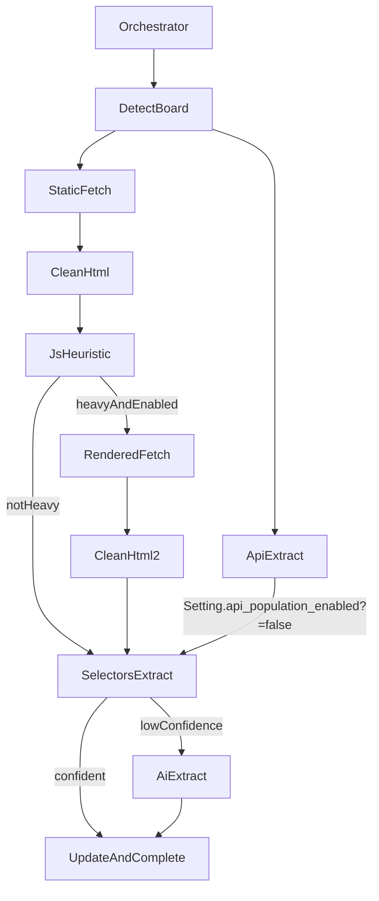

## Goals

- Add **JS-rendered page support** by introducing a Selenium-backed HTML fetcher and integrating it as an orchestrator fallback when static HTML is insufficient.
- For **job board URLs** (Greenhouse/Lever/Workable/Ashby/etc.), use a **selectors-first** extractor to pull the canonical fields (title, company, location, description, etc.) with AI fallback.
- Ensure **API extraction is fully disabled** when `Setting.api_population_enabled?` is false (including retries).
- Enhance **observability** so the admin UI can monitor both:
  - **step-by-step pipeline events** (`ScrapingEvent`)
  - **field-level extraction metrics** (`HtmlScrapingLog`), with **multiple logs per attempt** (static vs rendered vs retries)

## Key design decisions

- **Headless**: Selenium (run on same app server for now; modular so it can be moved to another container later).
- **Job boards**: selectors-first extraction per detected board type, with a consistent interface and AI fallback.

## Current state (verified)

- Job board detection is centralized in [`app/services/scraping/job_board_detector_service.rb`](app/services/scraping/job_board_detector_service.rb).
- Orchestrator already has an API gating check in `execute_api_extraction_internal` via `Setting.api_population_enabled?`.
- HTML fetching is currently static (`HTTParty.get`) via [`app/services/scraping/html_fetcher_service.rb`](app/services/scraping/html_fetcher_service.rb); JS-heavy pages will often return “shell” HTML.
- Retry path still attempts API extraction in [`app/services/scraping/retry_service.rb`](app/services/scraping/retry_service.rb) and must also respect `Setting.api_population_enabled?`.

## Implementation plan

### 1) Add rendered fetch capability (Selenium)

- **Add a new service**: `Scraping::RenderedHtmlFetcherService`
  - Responsibilities:
    - Open a URL in headless Chrome via Selenium.
    - Wait strategy: `document.readyState == 'complete'` + bounded wait for common job content selectors (configurable per board) + network quiet heuristic (best-effort).
    - Return `html_content` (full page source) and optionally a `text_snapshot` or `cleaned_html` using existing `Scraping::NokogiriHtmlCleanerService`.
    - Enforce strict limits: overall timeout, max bytes, max redirects (where applicable).
    - Record metadata: render mode, duration, user-agent, any JS errors captured (optional).

- **Runtime config**:
  - Add a setting/flag (e.g., `Setting.js_rendering_enabled?`) or reuse an environment flag to enable/disable Selenium in production.
  - Configure Selenium driver options for headless Chrome and server resources.

### 2) Decide when to use rendered fetch

- Add a **JS-heaviness heuristic** in orchestrator (or fetcher layer):
  - After static fetch + cleaning, if extracted text is below a threshold (e.g., `< 1,500 chars`) or missing key hints (no title/description blocks), consider it JS-heavy.
  - Also detect known SPA markers: `__NEXT_DATA__`, `data-reactroot`, empty `<main>`, etc.

- Integrate into [`app/services/scraping/orchestrator_service.rb`](app/services/scraping/orchestrator_service.rb):
  - In `execute_html_fetch_internal` (or immediately after HTML fetch), if heuristic triggers and rendering enabled:
    - Run `RenderedHtmlFetcherService`.
    - Cache rendered HTML (see caching section below).
    - Continue pipeline using rendered `html_content` / `cleaned_html`.

### 3) Cache rendered HTML (don’t re-render repeatedly)

- Extend existing caching in `ScrapedJobListingData` (used by `HtmlFetcherService`) by storing:
  - rendered HTML in the same `html_content` field (with metadata marking `rendered: true`), OR
  - add a second cached record keyed by `(url, fetch_mode)`.

- Recommendation (minimal schema impact): store rendered HTML in `html_content` and add metadata:
  - `metadata: { fetched_via: 'selenium', rendered: true, ... }`
  - Ensure `find_valid_for_url` can still return a valid cache regardless of fetch mode, or prefer rendered cache when available.

### 4) Implement selectors-first job board extractors

- Add a new module namespace:
  - `Scraping::JobBoards::BaseExtractor`
  - Concrete extractors for detected boards:
    - `GreenhouseExtractor`, `LeverExtractor`, `WorkableExtractor`, `AshbyExtractor`, `SmartRecruitersExtractor`, `BambooHrExtractor`, `IcimsExtractor`, `JobviteExtractor`

- Each extractor returns a common hash:
  - `{ title:, company_name:, location:, description:, requirements:, responsibilities:, remote_type:, salary_min:, salary_max:, confidence:, source: 'selectors', board_type: ... }`

- Integrate into [`app/services/scraping/orchestrator_service.rb`](app/services/scraping/orchestrator_service.rb):
  - After HTML fetch, before AI extraction:
    - If `board_type != :unknown`, attempt `selectors_first_extract(board_type, html_content)`.
    - If selectors extraction yields required fields with sufficient confidence, update job listing and complete attempt.
    - Otherwise fall back to AI extraction (existing `Scraping::AiJobExtractorService`).

- Use `Scraping::NokogiriHtmlCleanerService` to reduce content size before passing to AI.

### 5) Fully disable API fetchers when api_population_enabled is false

- Confirm orchestrator already gates API extraction.
- Update [`app/services/scraping/retry_service.rb`](app/services/scraping/retry_service.rb):
  - Wrap the “try API extraction first” branch in `Setting.api_population_enabled?`.
- Search for any other API entrypoints (e.g., direct fetcher usage) and gate similarly.

### 6) Observability + safety (events + logs)

#### A) ScrapingEvent timeline (Admin: ScrapingAttempt show)

- Add new `ScrapingEvent` event types and ensure they appear in the timeline:
  - `job_board_detection` (board_type, company_slug, job_id, api_supported?)
  - `js_heavy_detected` (heuristic metrics + reason)
  - `rendered_html_fetch` (selenium fetch result: duration, sizes, error)
  - `selectors_extraction` (fields extracted, missing_fields, confidence)
- Keep existing events:
  - `html_fetch`, `nokogiri_scrape`, `api_extraction`, `ai_extraction`, `data_update`, `completion`, `failure`
- When `Setting.api_population_enabled?` is false, record `api_extraction` as **skipped** with reason `api_population_disabled` (so timelines are explicit).

#### B) HtmlScrapingLog (Admin: dashboards + per-attempt comparisons)

- Change association to support **multiple logs per attempt**:
  - `ScrapingAttempt` should have `has_many :html_scraping_logs` (and optionally a `latest_html_scraping_log` helper/association for convenience).
- Extend HtmlScrapingLog to capture dimensions needed for monitoring:
  - fetch mode: `static` vs `rendered`
  - board_type: `greenhouse`, `lever`, `workable`, etc.
  - extractor_kind: `generic_html_scraping` vs `job_board_selectors`
  - run_context: `orchestrator` vs `retry`
- Ensure a new HtmlScrapingLog row is created per selectors pass:
  - static pass generates one log
  - rendered pass generates another log (if used)
  - retries generate additional logs
- Update admin attempt detail to display all logs for an attempt (static vs rendered vs retry) and link to HtmlScrapingLogs index filtered to that attempt/domain.

#### C) Safety + exception notifications

- Ensure exceptions notify via `ExceptionNotifier` with URL + board type context, including selenium failures and selector extractor failures.

### 7) Tests (focused)

- Add unit tests for:
  - JS-heaviness heuristic (input HTML → true/false).
  - Job board extractors: fixtures for at least Greenhouse + Lever HTML.
  - RetryService respects `Setting.api_population_enabled?`.
- Add tests to verify:
  - new `ScrapingEvent` types are recorded for rendered fallback and selectors extraction
  - multiple `HtmlScrapingLog` rows are created for static + rendered passes and for retries (when applicable)
- Add a light integration test for orchestrator choosing rendered fetch when static content is insufficient (can be stubbed/mocked).

## Rollout plan

- Ship with Selenium rendering behind a feature flag (on by default in your dedicated server environment).
- Monitor latency/cost: rendered fetch is expensive; keep strict timeouts and caching.
- Later: move Selenium to a separate worker/container and call it via HTTP/queue if needed.
