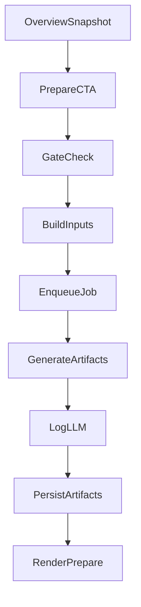

# InterviewApplication Prepare/History Tabs + Overview Prep Snapshot (V1)

## Goals

- Add tabs: **Overview | Feedback | Prepare | History** on `InterviewApplication#show`.
- **Prepare tab**: qualitative match analysis + focus areas + question framing + strength positioning, grounded in **job text + user resume/skills + prior feedback themes**, with **no invented experience** and **no fully scripted answers**.
- **Overview**: always show a compact **Prep Snapshot** that answers in ~10 seconds.
- **Gated + async**: Free gets a limited preview, Pro gets full Prepare, Sprint gets higher refresh limits.
- Maintain strong **logging/monitoring/observability/manageability** via Developer Portal + `Ai::ApiLoggerService`.

## What exactly goes on Overview (Prep Snapshot)

The **Prep Snapshot card is always present** on Overview:

- **Empty state (no prep generated yet)**: shows what will appear + CTA to add/paste JD (if missing) and to generate prep (if entitled).
- **Generated state**: shows these three elements:
- **Match label + gaps preview**: qualitative label (Strong/Partial/Stretch) + top “missing/weak” items (grounded in `FitAssessment.breakdown` and/or prep artifacts).
- **Top 3 focus areas preview**: first 3 focus bullets from the `focus_areas` artifact.
- **Next-round CTA**: button linking to Prepare tab, ideally scoped to the next upcoming `InterviewRound.stage` (fallback: pipeline stage mapping).

## UX / Information architecture

- **Overview tab**
- Status, summary, last feedback, quick insights.
- Prep Snapshot card (as defined above) + “Prepare smarter →” callout.
- **Prepare tab (new)**
- Job Match Analysis (qualitative)
- What to Focus On (expandable)
- Common Interview Questions (framing + outlines)
- Strength Positioning
- Input: prefer `job_listing` text; allow manual paste on the application.
- **History tab (new)**
- Read-only timeline via `ApplicationTimelineService`.

## Key repo building blocks we’ll reuse

- Resume → skills pipeline (`UserResume` / `Resumes::AnalysisService`).
- Fit breakdown (`ComputeFitAssessmentService` → `fit_assessment.breakdown`).
- Entitlements + quotas (`Billing::Entitlements`, `Billing::UsageCounter.increment!`).
- LLM prompt management + logging (`Ai::LlmPrompt` STI + `Ai::ApiLoggerService` → `Ai::LlmApiLog`).
- Timeline (`ApplicationTimelineService`).

## Data model (new)

- Add `InterviewApplication.job_description_text` (text) for manual paste fallback.
- Create `InterviewPrepArtifact` model to cache each section separately:
- `interview_application_id`, `user_id`
- `kind`: `match_analysis`, `focus_areas`, `question_framing`, `strength_positioning`
- `status`: `pending`, `computed`, `failed`
- `inputs_digest` (string)
- `content` (jsonb)
- `computed_at`, `error_message`

## Entitlements / gating

- Add Billing features (Developer Portal-manageable):
- Boolean: `interview_prepare_access`
- Quota: `interview_prepare_refreshes` (monthly)
- Free plan: show limited Prepare preview (recommend: Strength Positioning + 1 focus area).
- Pro/Sprint: full Prepare, differing refresh limits.

## Services & jobs (new)

- `InterviewPrep::InputsBuilderService`: builds grounded inputs and per-kind `inputs_digest`.
- 4 generators (separate prompts/services), each logging via `Ai::ApiLoggerService` with `operation_type` per section:
- `InterviewPrep::GenerateMatchAnalysisService`
- `InterviewPrep::GenerateFocusAreasService`
- `InterviewPrep::GenerateQuestionFramingService`
- `InterviewPrep::GenerateStrengthPositioningService`
- Background job: `GenerateInterviewPrepPackJob`
- Enforces entitlement + quota.
- Skips already-computed artifacts when digest matches.
- Increments usage counter **once per pack refresh**.

## Observability / manageability

- Add prompt STI classes so prompts are editable in Developer Portal:
- `Ai::InterviewPrepMatchPrompt`, `Ai::InterviewPrepFocusAreasPrompt`, `Ai::InterviewPrepQuestionFramingPrompt`, `Ai::InterviewPrepStrengthPositioningPrompt`.
- Ensure `Ai::ApiLoggerService` payload includes prep-specific fields (e.g., `match_label`, `focus_areas_count`) so logs remain actionable.

## UI wiring (key files)

- Update tabs + panels:
- [`app/views/interview_applications/show.html.erb`](app/views/interview_applications/show.html.erb)
- New partials:
    - `app/views/interview_applications/_prep_snapshot.html.erb`
    - `app/views/interview_applications/tabs/_prepare.html.erb`
    - `app/views/interview_applications/tabs/_history.html.erb`
- Controller updates:
- [`app/controllers/interview_applications_controller.rb`](app/controllers/interview_applications_controller.rb)
    - Permit `job_description_text`.
    - Load artifacts + derived “next round stage” for snapshot.
- New controller for Turbo actions:
- `InterviewApplicationPrepsController` refresh + JD update.

## Mermaid: data flow

